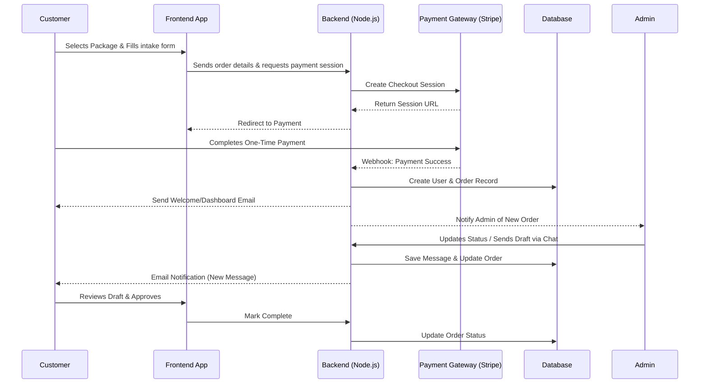
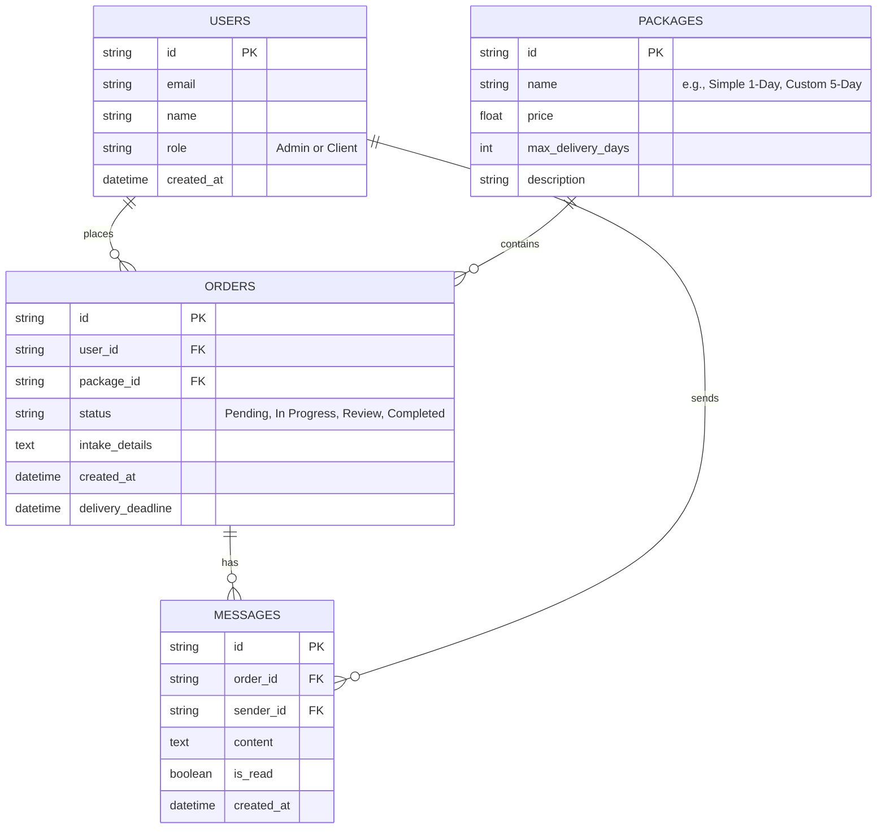

# PRD — Project Requirements Document

## 1. Overview
Many businesses and individuals in the United States need a website quickly, but working with traditional agencies can be a slow, complex, and expensive process. This product is a modern, interactive web development service platform with a bold promise: **"Build your website in one day."** 

The application serves as both a storefront and an operational hub for a solo founder. It allows customers to browse past work, select a service package (ranging from a simple 1-day landing page to a fully customized 5-day web project), submit their project requirements, and securely pay upfront. An intuitive customer portal allows clients and the admin to communicate seamlessly via in-app chat and email, ensuring rapid delivery and high customer satisfaction. 

## 2. Requirements
- **Tiered Packages:** Offer standardized packages with distinct features. The base package must guarantee delivery in 1 day, while the highest-tier package guarantees delivery in a maximum of 5 days.
- **US-Centric Payments:** Smooth, secure checkout supporting US payment preferences, specifically Credit Cards (via Stripe) and PayPal. All monetization relies on one-time payments per project.
- **Unified Client-Admin Communication:** An in-app chat system integrated with email notifications so neither the client nor the admin misses an update.
- **Rapid Launch Timeline:** The MVP (Minimum Viable Product) must be developed and launched within an ambitious 1-month timeframe by a solo founder.
- **Admin Efficiency:** A streamlined backend system allowing a solo admin to easily track ongoing orders, manage deadlines, upload deliverables, and chat with clients without needing multiple external tools.
- **High-Converting UI/UX:** The storefront must look highly professional, interactive, and modern to instill trust in the "1-day delivery" promise.

## 3. Core Features
**Customer Facing:**
- **Service Catalog & Checkout:** Clear presentation of the 1-to-5-day service packages. Includes a dynamic checkout flow that captures necessary project details (branding, text, requirements) before payment.
- **Client Dashboard:** A private workspace where clients can view their active order status (e.g., *Requirements Submitted, Designing, Review, Completed*).
- **In-App Messaging:** A secure chat window inside the dashboard to talk with the developer, share feedback, and send/receive assets.

**Admin Facing:**
- **Order Management Board:** A centralized view (like a Kanban board) to see all incoming, active, and completed projects at a glance, highlighting deadlines.
- **Admin Chat & Notification Hub:** A single place to reply to all client chats. Triggers automatic email alerts to clients when a new message or delivery is posted.
- **Portfolio & Service Manager:** Features to quickly update the pricing of packages or add newly completed sites to the public portfolio.

## 4. User Flow
1. **Discovery & Selection:** A customer visits the landing page, reads the "Build your website in one day" value proposition, views out the portfolio, and chooses a package.
2. **Onboarding & Payment:** The customer fills out a simple intake form (company name, desired style, quick notes) and completes a one-time payment via Stripe or PayPal.
3. **Account Creation:** Upon successful payment, an account is automatically created. The customer receives a welcome email with a secure link to access their Client Dashboard.
4. **Fulfillment (Admin Side):** The admin receives an alert about the new order, reviews the intake form, and moves the status to "In Progress". 
5. **Collaboration:** The admin and client communicate via the dashboard's built-in chat. The admin shares drafts, and the client provides feedback. Email notifications keep both parties in the loop.
6. **Delivery:** The admin drops the final website assets/links into the dashboard and marks the order as "Completed." The client approves the delivery.

## 5. Architecture
The system follows a modern web architecture where the frontend handles the interactive UI and the backend manages the business logic, secure payments, and database operations. Real-time features or polling will be used for the in-app chat.

## 6. Database Schema
To keep the application fast and simple to maintain, the database is structured around four primary entities: Users, Packages, Orders, and Messages.

### Tables Overview
- **Users**: Stores both customer and admin information.
- **Packages**: Stores available service tiers (1-day to 5-day options).
- **Orders**: Connects users to packages and tracks delivery status.
- **Messages**: Stores all chat history attached to a specific order.

## 7. Tech Stack
Based on the preference for a robust React/Node.js ecosystem that enables a solo founder to ship within a month, the following stack is recommended:

- **Frontend:** Next.js (React framework for both Server-Side and Client-Side rendering), Tailwind CSS (for rapid, modern styling), and shadcn/ui (for accessible, beautiful pre-built components).
- **Backend:** Node.js (utilizing Next.js API Routes/Server Actions to keep everything in one repository, streamlining the 1-month development cycle).
- **Database:** PostgreSQL managed by Supabase or Neon (offers robust relational data and easy scaling), interacted with via Drizzle ORM for type-safe database queries.
- **Authentication:** Better Auth (easy integration for magic links or standard email/password).
- **Payments:** Stripe (primary for Credit Cards out of the box) & PayPal SDK.
- **Communications:** Resend (for transactional emails and notifications). Next.js polling or Supabase Realtime can be used to power the in-app chat.